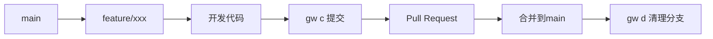
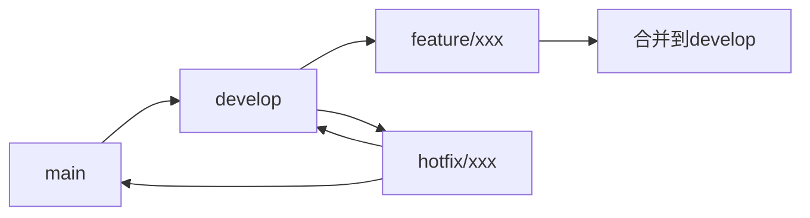

# 最佳实践

本指南总结了使用 Git Workflow 的最佳实践，帮助你和团队建立高效、规范的 Git 工作流程。

## 🎯 工作流程设计

### 选择合适的工作流模式

根据团队规模和项目特点选择合适的工作流：

#### 个人开发 - GitHub Flow



**配置：**
```json
{
  "baseBranch": "main",
  "requireId": false,
  "autoPush": true
}
```

#### 团队协作 - Git Flow



**配置：**
```json
{
  "baseBranch": "develop",
  "requireId": true,
  "featureIdLabel": "Jira ID",
  "hotfixIdLabel": "Bug ID",
  "autoPush": true
}
```

#### 企业级 - 严格审查流程

**配置：**
```json
{
  "featurePrefix": "feat",
  "hotfixPrefix": "fix",
  "requireId": true,
  "useEmoji": false,
  "autoStage": false
}
```

## 📋 日常开发流程

### 标准功能开发流程

```bash
# 1. 创建功能分支
gw f
# 输入: PROJ-123, add-user-profile

# 2. 开发代码...

# 3. 提交代码（推荐使用 AI）
gw c

# 4. 推送并创建 PR
git push origin feature/20260111-PROJ-123-add-user-profile

# 5. 合并后清理分支
gw d
```

### 紧急修复流程

```bash
# 1. 创建 hotfix 分支
gw h --base main
# 输入: BUG-456, fix-payment-error

# 2. 修复问题
gw c

# 3. 创建补丁版本
gw t
# 选择: patch → v1.2.1

# 4. 合并到主分支和开发分支
```

### 版本发布流程

```bash
# 1. 更新版本号
gw r
# 选择: minor → 1.3.0

# 2. 创建发布标签
gw t
# 创建 v1.3.0

# 3. 清理功能分支
gw d
```

## ⚙️ 配置管理策略

### 分层配置原则

**全局配置（个人偏好）：**
```json
{
  "aiCommit": {
    "enabled": true,
    "provider": "github",
    "language": "zh-CN"
  },
  "useEmoji": true,
  "autoStage": true
}
```

**项目配置（团队规范）：**
```json
{
  "baseBranch": "develop",
  "requireId": true,
  "featureIdLabel": "Story ID",
  "autoPush": true
}
```

### 配置文档化

将项目配置提交到版本控制并文档化：

```bash
# 提交配置文件
git add .gwrc.json
git commit -m "chore: 添加 git-workflow 配置"
```

在 README 中说明配置：
```markdown
## Git Workflow 配置

本项目使用 git-workflow 进行版本管理：

- 分支前缀：feature/、hotfix/
- 必须填写 Story ID
- 基于 develop 分支开发
- 自动推送到远程

### 使用方法
1. 安装：`npm install -g @zjex/git-workflow`
2. 创建分支：`gw f`
3. 提交代码：`gw c`
```

## 🤝 团队协作规范

### 统一工具版本

在项目中指定工具版本：

```json
{
  "engines": {
    "git-workflow": "^0.2.24"
  }
}
```

### 制定工作流程规范

**分支管理规范：**
- Feature 分支基于 develop 创建
- Hotfix 分支基于 main 创建
- 分支合并后及时删除
- 定期清理过期分支

**提交信息规范：**
- 优先使用 AI 生成提交信息
- 遵循 Conventional Commits 格式
- 包含必要的 scope 和描述
- 关联相关的 Issue

**代码审查规范：**
- 所有代码变更必须经过审查
- 提交信息必须规范
- 分支命名必须符合规范
- CI 检查必须通过

### Pull Request 模板

```markdown
## 变更类型
- [ ] 新功能 (feature)
- [ ] Bug 修复 (fix)
- [ ] 文档更新 (docs)

## 变更描述
简要描述本次变更的内容和原因。

## 测试说明
- [ ] 单元测试通过
- [ ] 手动测试完成

## 相关 Issue
Closes #123
```

## 📊 质量保证

### 自动化检查

使用 CI/CD 集成检查：

```yaml
# .github/workflows/check.yml
name: Git Workflow Check
on:
  pull_request:
    branches: [main, develop]

jobs:
  check-branch-name:
    runs-on: ubuntu-latest
    steps:
      - name: Check branch name
        run: |
          if [[ ! "${{ github.head_ref }}" =~ ^(feature|hotfix)/[0-9]{8}-.+ ]]; then
            echo "分支名不符合规范"
            exit 1
          fi
```

### 度量和监控

定期检查工作流质量：

```bash
#!/bin/bash
# 分支统计
echo "📊 活跃分支数量:"
git branch -r | grep -E 'origin/(feature|hotfix)/' | wc -l

# 提交规范性检查
echo "📊 提交信息规范性:"
git log --oneline --since="1 week ago" | \
  grep -E '^[a-f0-9]+ (feat|fix|docs|style|refactor|perf|test|build|ci|chore)' | \
  wc -l
```

## 🚀 性能优化

### 提高执行效率

**使用快捷命令：**
```bash
# 设置别名
alias gwf='gw f'
alias gwc='gw c'
alias gwt='gw t'
```

**优化配置：**
```json
{
  "autoPush": true,           // 减少交互
  "autoStage": true,          // 自动暂存
  "defaultTagPrefix": "v",    // 跳过选择
  "aiCommit": {
    "model": "gpt-4o-mini",   // 使用快速模型
    "maxTokens": 150          // 减少 token 消耗
  }
}
```

### 本地化 AI 模型

对于高频使用或隐私要求高的场景：

```bash
# 安装 Ollama
curl -fsSL https://ollama.com/install.sh | sh

# 下载模型
ollama pull llama3.2:3b

# 配置使用本地模型
{
  "aiCommit": {
    "provider": "ollama",
    "model": "llama3.2:3b"
  }
}
```

## 🔧 故障排除

### 常见问题解决

**分支管理问题：**
- 定期清理已合并分支：`gw d`
- 强制要求 ID：`"requireId": true`
- 统一分支前缀：`"featurePrefix": "feat"`

**提交信息问题：**
- 启用 AI commit 提高规范性
- 配置 commitlint 进行检查
- 团队培训提高意识

**性能问题：**
- 使用本地 AI 模型
- 优化网络连接
- 减少不必要的交互

### 应急处理

**误删分支恢复：**
```bash
# 查看操作历史
git reflog

# 恢复分支
git checkout -b recovered-branch <commit-hash>
```

**配置文件损坏：**
```bash
# 重新初始化配置
gw init --reset

# 或手动修复 JSON 语法
```

## 💡 进阶技巧

### 自定义工作流

根据项目特点自定义工作流：

```json
{
  "featurePrefix": "feat",
  "hotfixPrefix": "fix",
  "requireId": true,
  "featureIdLabel": "需求编号",
  "hotfixIdLabel": "缺陷编号",
  "commitEmojis": {
    "feat": "🎉",
    "fix": "🔧"
  }
}
```

### 脚本化操作

创建自动化脚本：

```bash
#!/bin/bash
# auto-release.sh
set -e

echo "🚀 开始发布流程..."
npm test
gw r
gw c
gw t
git push origin main --tags
npm publish
echo "✅ 发布完成！"
```

### 集成其他工具

与现有工具链集成：

```bash
# 与 commitizen 集成
npm install -g commitizen cz-conventional-changelog

# 与 husky 集成进行 pre-commit 检查
npx husky add .husky/pre-commit "gw --check-branch-name"
```

## 📚 持续改进

### 定期回顾

- **每周回顾** - 检查分支清理情况
- **每月回顾** - 分析提交质量和工作流效率
- **季度回顾** - 评估配置是否需要调整

### 团队反馈

- 收集团队使用反馈
- 根据项目发展调整配置
- 分享最佳实践和技巧

### 工具更新

- 定期更新到最新版本：`gw upt`
- 关注新功能和改进
- 参与社区讨论和贡献

---

遵循这些最佳实践，你和团队可以建立高效、规范的 Git 工作流程。记住，最佳实践需要根据具体情况调整，关键是保持一致性和持续改进。