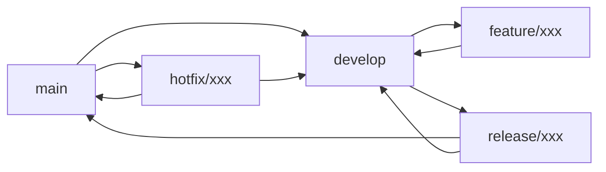
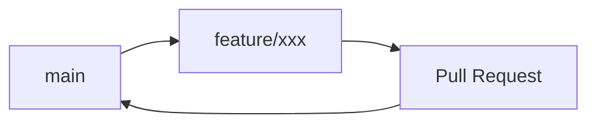
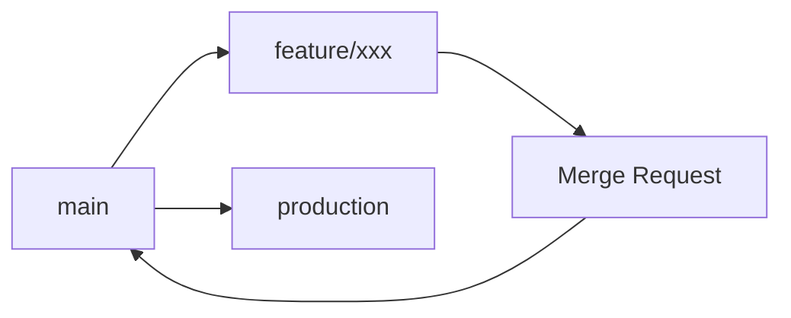

# 分支管理

分支管理是 Git Workflow 的核心功能，提供了规范化的分支创建、命名和生命周期管理。

## 🎯 分支管理理念

### 规范化命名

Git Workflow 自动生成规范的分支名称：

```
feature/YYYYMMDD-[ID-]description
hotfix/YYYYMMDD-[ID-]description
```

**优势：**
- 📅 **时间排序** - 按创建日期自然排序
- 🔍 **易于搜索** - 可以按日期或 ID 快速查找
- 📋 **可追溯性** - 每个分支都能追溯到具体需求
- 🤖 **自动生成** - 无需手动输入复杂的分支名

### 智能基础分支检测

自动检测合适的基础分支：

1. **配置文件设置** - 检查 `baseBranch` 配置
2. **自动检测** - 检测 `main` 或 `master` 分支
3. **当前分支** - 使用当前分支作为基础

## 🌿 Feature 分支管理

### 创建 Feature 分支

```bash
gw f
# 或使用别名
gw feature
gw feat
```

### 交互式创建流程

```bash
gw f
? 请输入 Story ID (可跳过): PROJ-123
? 请输入描述: add-user-authentication
✔ 分支创建成功: feature/20260111-PROJ-123-add-user-authentication
? 是否推送到远程? 是
✔ 已推送到远程: origin/feature/20260111-PROJ-123-add-user-authentication
```

### 高级选项

#### 指定基础分支

```bash
# 基于 develop 分支创建
gw f --base develop

# 基于特定分支创建
gw f --base release/1.0

# 基于特定提交创建
git checkout abc1234
gw f
```

#### 处理未提交更改

当前分支有未提交更改时，Git Workflow 会智能处理：

```bash
gw f
检测到未提交的更改:
 M src/index.ts
 M src/utils.ts
 ?? src/new-file.ts
────────────────────────────────────────
? 是否暂存 (stash) 这些更改后继续?
❯ 是，暂存更改并创建分支
  否，取消操作

✔ 更改已暂存到 stash
✔ 分支创建成功: feature/20260111-PROJ-123-add-auth
💡 提示: 使用 'gw s' 可以恢复暂存的更改
```

### Feature 分支最佳实践

#### 1. 功能粒度控制

**推荐做法：**
```bash
# 单一功能分支
feature/20260111-PROJ-123-add-user-login
feature/20260111-PROJ-124-add-user-profile
feature/20260111-PROJ-125-add-user-settings
```

**避免的做法：**
```bash
# 过于宽泛的分支
feature/20260111-PROJ-100-user-module
```

#### 2. 及时同步

```bash
# 定期同步主分支
git checkout feature/20260111-PROJ-123-add-login
git pull origin develop
git merge develop

# 或使用 rebase
git rebase develop
```

#### 3. 保持分支整洁

```bash
# 开发过程中频繁提交
gw c  # 每个逻辑单元都提交

# 合并前整理提交历史（可选）
git rebase -i develop
```

## 🐛 Hotfix 分支管理

### 创建 Hotfix 分支

```bash
gw h
# 或使用别名
gw hotfix
gw fix
```

### Hotfix 特点

**与 Feature 分支的区别：**

| 特性       | Feature 分支           | Hotfix 分支            |
| ---------- | ---------------------- | ---------------------- |
| 用途       | 新功能开发             | 紧急问题修复           |
| 基础分支   | develop（通常）        | main/master（通常）    |
| 生命周期   | 较长（数天到数周）     | 较短（数小时到数天）   |
| 合并策略   | 合并到 develop         | 同时合并到 main 和 develop |
| ID 标签    | Story ID               | Issue ID               |

### Hotfix 工作流程

```bash
# 1. 基于 main 创建 hotfix 分支
gw h --base main
# 输入: BUG-456, fix-payment-calculation

# 2. 快速修复问题
# 修改相关文件

# 3. 提交修复
gw c
# AI 生成: 🐛 fix(payment): 修复支付金额计算错误

# 4. 创建补丁版本
gw t
# 选择: patch → v1.2.1

# 5. 合并到 main 分支
git checkout main
git merge hotfix/20260111-BUG-456-fix-payment-calculation

# 6. 合并到 develop 分支
git checkout develop
git merge hotfix/20260111-BUG-456-fix-payment-calculation

# 7. 删除 hotfix 分支
gw d
```

### 紧急修复场景

#### 1. 生产环境 Bug

```bash
# 用户报告支付功能异常
gw h --base main
# BUG-789, fix-payment-gateway-timeout

# 快速定位和修复
# 提交修复
gw c

# 立即发布补丁版本
gw t  # patch → v2.1.3
```

#### 2. 安全漏洞修复

```bash
# 发现安全漏洞
gw h --base main
# SEC-101, fix-sql-injection-vulnerability

# 修复安全问题
# 提交修复
gw c

# 发布安全补丁
gw t  # patch → v2.1.4
```

#### 3. 关键功能故障

```bash
# 核心功能无法使用
gw h --base main
# CRIT-202, fix-database-connection-pool

# 修复关键问题
# 提交修复
gw c

# 发布紧急补丁
gw t  # patch → v2.1.5
```

## 🗑️ 分支清理管理

### 智能分支删除

```bash
gw d
```

### 分支列表显示

```bash
? 选择要删除的分支:
❯ feature/20260105-PROJ-100-old-feature (本地+远程) 3 days ago
  feature/20260103-PROJ-101-test-feature (仅本地) 5 days ago
  hotfix/20260101-BUG-200-urgent-fix (本地+远程) 1 week ago
  取消
```

**信息说明：**
- **分支名** - 完整的分支名称
- **状态** - 本地分支、远程分支或两者都有
- **时间** - 最后提交时间，按最近使用排序

### 删除确认流程

```bash
分支信息:
  名称: feature/20260105-PROJ-100-old-feature
  最后提交: 3 days ago
  提交信息: feat(user): 添加用户管理功能
  状态: 本地+远程分支都存在
  提交数: 15 commits ahead of develop
────────────────────────────────────────
? 确认删除?
❯ 是，删除本地和远程分支
  仅删除本地分支
  取消

✔ 本地分支已删除: feature/20260105-PROJ-100-old-feature
✔ 远程分支已删除: origin/feature/20260105-PROJ-100-old-feature
```

### 批量清理策略

#### 1. 定期清理

```bash
# 每周清理一次已合并的分支
gw d
# 选择已合并的分支进行删除
```

#### 2. 按时间清理

```bash
# 删除超过一个月的分支
git for-each-ref --format='%(refname:short) %(committerdate)' refs/heads | \
  awk '$2 < "'$(date -d '1 month ago' '+%Y-%m-%d')'"' | \
  cut -d' ' -f1 | \
  grep -E '^(feature|hotfix)/' | \
  xargs -I {} git branch -D {}
```

#### 3. 按状态清理

```bash
# 使用 Git 命令清理已合并的分支
git branch --merged develop | \
  grep -E '^  (feature|hotfix)/' | \
  xargs -I {} git branch -d {}
```

### 安全保护机制

**保护规则：**
- 🛡️ **当前分支保护** - 不能删除当前所在的分支
- 🛡️ **主分支保护** - 不显示 main/master/develop 等主分支
- 🛡️ **确认机制** - 删除前需要明确确认
- 🛡️ **状态检查** - 显示分支的本地/远程状态

## ⚙️ 分支配置管理

### 基础配置

```json
{
  "baseBranch": "develop",
  "featurePrefix": "feature",
  "hotfixPrefix": "hotfix",
  "requireId": true,
  "featureIdLabel": "Story ID",
  "hotfixIdLabel": "Issue ID",
  "autoPush": true
}
```

### 配置项详解

#### 分支前缀配置

```json
{
  "featurePrefix": "feat",
  "hotfixPrefix": "fix"
}
```

生成的分支名：
```
feat/20260111-PROJ-123-add-login
fix/20260111-BUG-456-fix-crash
```

#### ID 要求配置

```json
{
  "requireId": true,
  "featureIdLabel": "Jira ID",
  "hotfixIdLabel": "Bug ID"
}
```

**效果：**
- 创建分支时必须填写 ID，不能跳过
- 自定义 ID 输入提示文字

#### 自动推送配置

```json
{
  "autoPush": true
}
```

**选项说明：**
- `true` - 创建分支后自动推送，不询问
- `false` - 创建分支后不推送，不询问
- 不设置 - 每次创建分支时询问（默认）

### 团队配置示例

#### 敏捷开发团队

```json
{
  "baseBranch": "develop",
  "requireId": true,
  "featureIdLabel": "Story ID",
  "hotfixIdLabel": "Bug ID",
  "autoPush": true
}
```

#### 开源项目

```json
{
  "baseBranch": "main",
  "requireId": false,
  "featurePrefix": "feature",
  "hotfixPrefix": "hotfix",
  "autoPush": false
}
```

#### 企业级项目

```json
{
  "baseBranch": "develop",
  "featurePrefix": "feat",
  "hotfixPrefix": "fix",
  "requireId": true,
  "featureIdLabel": "需求编号",
  "hotfixIdLabel": "缺陷编号",
  "autoPush": true
}
```

## 🔄 分支工作流模式

### Git Flow 模式



**配置：**
```json
{
  "baseBranch": "develop",
  "requireId": true,
  "autoPush": true
}
```

**操作流程：**
```bash
# 功能开发
gw f --base develop
# 开发完成后合并到 develop

# 发布准备
git checkout -b release/1.2.0 develop
# 测试完成后合并到 main 和 develop

# 紧急修复
gw h --base main
# 修复完成后合并到 main 和 develop
```

### GitHub Flow 模式



**配置：**
```json
{
  "baseBranch": "main",
  "requireId": false,
  "autoPush": true
}
```

**操作流程：**
```bash
# 功能开发
gw f --base main
# 开发完成后创建 Pull Request
# 审查通过后合并到 main
```

### GitLab Flow 模式



**配置：**
```json
{
  "baseBranch": "main",
  "requireId": true,
  "featureIdLabel": "Issue ID",
  "autoPush": true
}
```

## 🎯 分支管理场景

### 场景一：并行功能开发

```bash
# 开发者 A
gw f --base develop
# PROJ-123, add-user-authentication

# 开发者 B
gw f --base develop
# PROJ-124, add-payment-system

# 开发者 C
gw f --base develop
# PROJ-125, add-notification-service

# 各自独立开发，完成后合并到 develop
```

### 场景二：功能依赖管理

```bash
# 基础功能分支
gw f --base develop
# PROJ-100, add-user-system

# 完成基础功能后，基于此分支创建依赖功能
git checkout feature/20260111-PROJ-100-add-user-system
gw f
# PROJ-101, add-user-profile

# 或者等基础功能合并后再开发
```

### 场景三：实验性功能

```bash
# 创建实验分支
gw f --base develop
# EXP-001, try-new-ui-framework

# 实验成功，继续开发
gw c  # 提交实验结果

# 实验失败，直接删除分支
gw d  # 删除实验分支
```

### 场景四：长期功能分支

```bash
# 创建长期功能分支
gw f --base develop
# EPIC-001, redesign-user-interface

# 定期同步主分支
git pull origin develop
git merge develop

# 分阶段提交
gw c  # 阶段一完成
gw c  # 阶段二完成
gw c  # 阶段三完成

# 功能完成后合并
```

## 🔧 高级分支技巧

### 技巧一：分支重命名

```bash
# 重命名当前分支
git branch -m new-branch-name

# 重命名其他分支
git branch -m old-name new-name

# 更新远程分支
git push origin :old-name new-name
git push origin -u new-name
```

### 技巧二：分支比较

```bash
# 比较分支差异
git diff develop..feature/20260111-PROJ-123-add-login

# 查看分支提交差异
git log develop..feature/20260111-PROJ-123-add-login --oneline

# 查看文件变更统计
git diff --stat develop..feature/20260111-PROJ-123-add-login
```

### 技巧三：分支合并策略

```bash
# 快进合并（保持线性历史）
git merge --ff-only feature-branch

# 非快进合并（保留分支信息）
git merge --no-ff feature-branch

# 压缩合并（将多个提交合并为一个）
git merge --squash feature-branch
```

### 技巧四：分支恢复

```bash
# 查看删除的分支
git reflog

# 恢复误删的分支
git checkout -b recovered-branch <commit-hash>

# 或者
git branch recovered-branch <commit-hash>
```

## 🚨 常见问题解决

### 问题一：分支名冲突

```bash
❌ 分支 'feature/20260111-PROJ-123-add-login' 已存在
```

**解决方案：**
1. 使用不同的描述
2. 切换到现有分支继续开发
3. 删除现有分支后重新创建

### 问题二：基础分支不存在

```bash
❌ 基础分支 'develop' 不存在
```

**解决方案：**
```bash
# 创建并切换到 develop 分支
git checkout -b develop main

# 或从远程拉取
git fetch origin develop:develop
```

### 问题三：无法删除远程分支

```bash
❌ 远程分支删除失败: 权限不足
```

**解决方案：**
1. 检查推送权限
2. 手动删除：`git push origin --delete branch-name`
3. 联系仓库管理员

### 问题四：分支包含未合并的更改

```bash
❌ 分支包含未合并的更改，无法删除
```

**解决方案：**
```bash
# 强制删除本地分支
git branch -D branch-name

# 或先合并更改
git checkout main
git merge branch-name
```

## 📊 分支管理度量

### 关键指标

- **分支数量** - 当前活跃分支数量
- **分支生命周期** - 从创建到合并的平均时间
- **分支大小** - 每个分支的提交数量
- **合并频率** - 每天/周的分支合并次数

### 监控脚本

```bash
#!/bin/bash
# branch-metrics.sh

echo "=== 分支管理度量报告 ==="
echo "时间: $(date)"
echo

# 活跃分支统计
echo "📊 活跃分支统计:"
git branch -r | grep -E 'origin/(feature|hotfix)/' | wc -l | xargs echo "远程分支数:"
git branch | grep -E '^  (feature|hotfix)/' | wc -l | xargs echo "本地分支数:"
echo

# 分支年龄分析
echo "📊 分支年龄分析:"
git for-each-ref --format='%(refname:short) %(committerdate:relative)' refs/heads/ | \
  grep -E '^(feature|hotfix)/' | \
  head -10
echo

# 最近合并的分支
echo "📊 最近合并的分支:"
git log --merges --oneline --since="1 week ago" | head -5
```

---

通过系统化的分支管理，你可以建立清晰、高效的开发工作流。Git Workflow 的分支管理功能让复杂的 Git 操作变得简单，帮助团队保持代码库的整洁和可维护性。